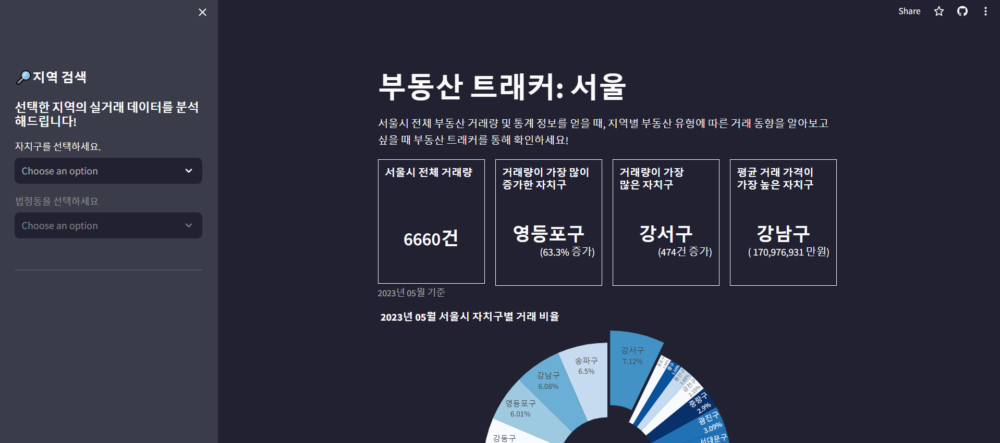
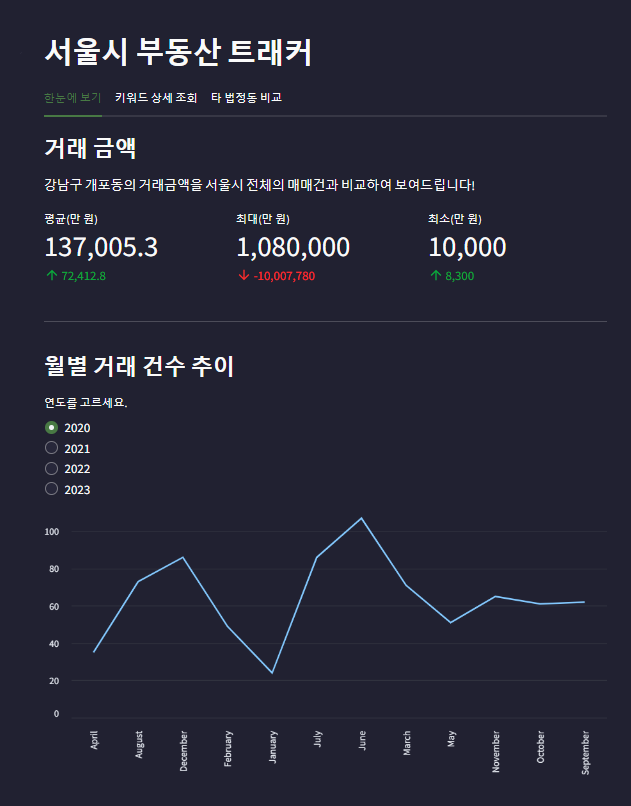
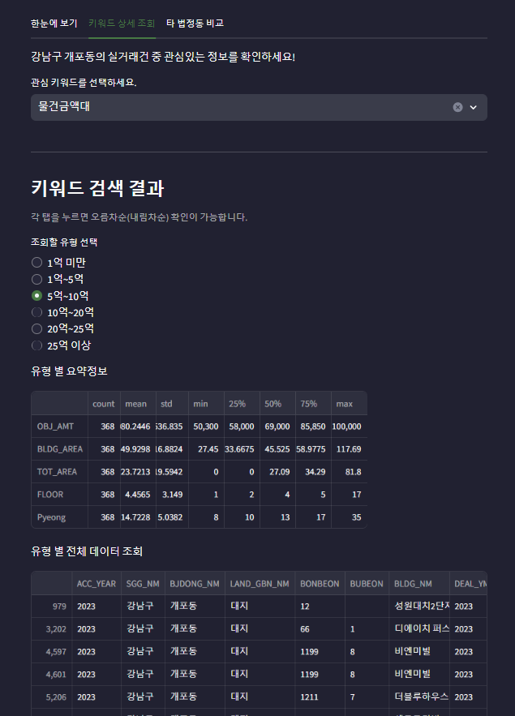
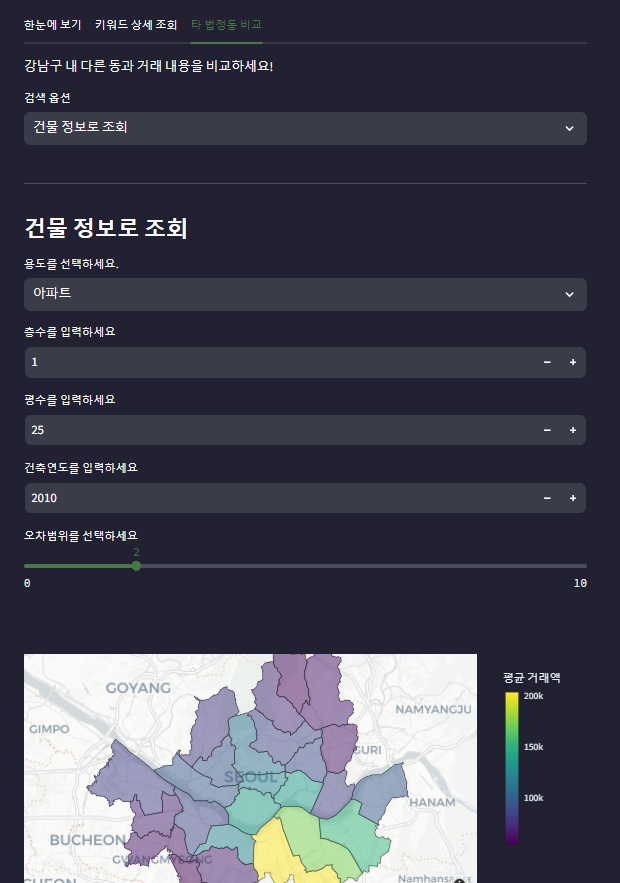

# 프로젝트의 목적
- 본 프로젝트는 2020년부터 2023년까지의 서울시 부동산 실거래 데이터를 바탕으로 판매자들에게 부동산 가격을 책정할 때 유의미한 정보를 주는 목표를 가지고 있습니다.
- 이를 위해서 사용자에게 세분화된 지역(구->동)을 기준으로 세부 분석 내용을 제공합니다.
  - **한눈에 보기** 탭에서 거래금액 분석, 월별 거래 건수 추이, 건물유형별 거래 데이터를 시각화하여 제공하고 있습니다.
  - **키워드 상세 조회** 탭에서 관심 키워드를 선택하여 키워드 내 유형별로 요약정보와 전체 내용을 제공하고 있습니다.
  - **타 법정동 비교** 탭에서 관심지역의 거래 내용을 자치구 내 타 동과 비교할 수 있습니다.
    - **건물 정보로 조회** 옵션으로 특정 건물 조건에 부합하는 자치구 내의 실거래건을 서울시 지도 위에 시각화하여 제공하고 있습니다.
    - **건물 가격으로 조회** 옵션으로 건물 가격 범위를 설정하고, 설정한 범위 내에 해당하는 자치구 내 타 법정동의 모든 데이터를 확인할 수 있습니다.
  

## 팀원 소개
- 나한울 팀장 : 깃허브 주소 공유
- 김영환 팀원 : https://github.com/younghwangit/
- 양인선 팀원 : 깃허브 주소 공유
- 이상훈 팀원 : 깃허브 주소 공유
- 정소영 팀원 : 깃허브 주소 공유
- 황유진 팀원 : https://github.com/yellayujin/miniproject2


# 본 프로젝트에서 사용한 주요 개발환경 요약
  + Programming Languages : Python(ver. 3.12.1)
  + Web Framework : Streamlit (ver. 1.31.0)

## 주요 라이브러리 버전
  + [requirements.txt](requirements.txt) 파일 참조

## 테스트 준비 및 방법
- 원격 저장소의 주소를 복사한 다음 로컬 환경에 복제합니다.

```bash
git clone "https://github.com/yellayujin/miniproject2.git"  
```

- 폴더 최상위 경로에서 가상환경을 설치합니다.

```bash
pip install virtualenv #기존에 설치한 가상환경이 있다면 생략 가능
virtualenv venv
```

- 가상환경에 접속합니다.
```bash
source venv/Scripts/activate
```

- 라이브러리를 설치합니다.
```bash
pip install -r requirements.txt
```

- 일반적인 파이썬 `.py` 파일을 실행할 경우
```bash
python a.py
```

- Streamlit 파일 `.py` 파일을 실행할 경우
```bash
streamlit run app.py
```

# 데모페이지
- Streamlit에서 구현한 Demo는 다음과 같습니다.
  + https://yellayujin-miniproject2-app-dlixks.streamlit.app/

 ## 주요 기능
 - 본 프로젝트에서 자체 개발 및 활용한 주요 메서드는 다음과 같습니다.

| Functions | Location | Description |
|---|---|---|
| main | app.py  | for deploy |
| load_data | data_collect.py | for loading dataset and creating new columns |


### main()
- [app.py](app.py) 파일 참조
- 첫 페이지에서는 서울시 전체 부동산 실거래 데이터를 분석한 결과를 보여줍니다. (2023년 05월 기준)
- 사이드바에서 분석을 원하는 자치구와 법정동을 선택합니다. 해당 지역의 실거래 데이터를 분석한 결과를 보여줍니다.

- `sgg_nm_sort: 자치구`
- `selected_sgg_nm: 선택된 자치구 `
- `selected_bjdong_nm: 선택된 법정동`
- `filtered_data: 선택된 자치구와 법정동 데이터`


- 결과 이미지
<p align = "center" width = "100%">
   # 수정하기
  
  
  
</p>


### load_data():
- [data_collect.py](data_collect.py) 파일 참조

- `load_data()` 함수는 데이터를 불러화 전처리를 하는 함수입니다.
- `DEAL_YMD` 컬럼의 데이터를 문자열 데이터로 변환하여 형식을 통일했습니다.
- `BLDG_AREA` 데이터를 활용하여 `Pyeong` 데이터를 생성하고 `Range()` 함수를 통해 범주화했습니다.

- `df: csv파일의 형태로 출력한 데이터셋`
- `DEAL_YMD: 계약일`
- `Pyeong: 평수 (BLDG_AREA/3.3)`
- `Pyeong_range: 평수를 10평 단위로 범주화`


## 코드 에러 문의 
- 메뉴 `Issues`-`New Issues`-`메모 남기기`-`Submit new issue`
- e-mail: skrtkd0416@naver.com


# 발표자료 PDF 
- 발표자료 PDF는 아래와 같습니다.
  + [00발표자료_2024](portfolio.pdf)


## License
[](https://opensource.org/licenses/MIT)
